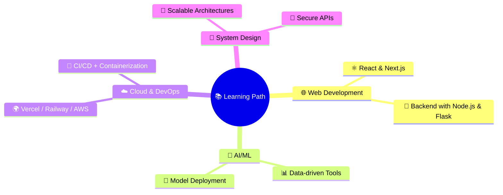

# 👨‍💻 Adarsh Sikreewal

  
  
  

---

## 🌟 About Me

- 🎓 **B.Tech CSE Student** at **KIIT University** (4th Year)
- 🧰 Full-Stack Developer & Tech Explorer
- 🧠 Working on **AI/ML**, **EdTech Tools**, and **Automation Projects**
- 💬 Passionate about solving real-world problems with code
- 🌦️ Built a **Fertilizer Recommender** using weather, soil, and crop data
- 📍 Based in **Jharkhand, India**

 

---

## 🛠️ Tech Arsenal

### 💻 Languages & Frameworks

  

### 🗄️ Databases & Platforms

  

### 🔧 Tools & Technologies

  

---

## 📊 GitHub Stats

  

---

## 🚀 Featured Projects

| Project                            | Description                                                                                                                                            | Tech Stack                   | Links                                                         |
| ---------------------------------- | ------------------------------------------------------------------------------------------------------------------------------------------------------ | ---------------------------- | ------------------------------------------------------------- |
| 🌾 **Fertilizer Optimizer**       | Predicts the right fertilizer type, quantity & timing using soil + crop + weather data. Built with ML & Flask.                                        | Python, Flask, ML            | [GitHub](#)                                                   |
| 🌍 **Project Management App**      | Sleek dashboard with CRUD, Auth, inventory tracking, and analytics.                                              | Next.js, Tailwind CSS, Neon  | [Live](#)                                                      |
| 🧠 **AI Tools for Students**       | Smart academic aids for personalized notes, quizzes & recommendation.                                            | React, Python, OpenAI API    | [GitHub](#)                                                   |
| 📸 **Image Finder Web App**        | Search high-quality images with user auth.                                                                      | Next.js, PostgreSQL, Auth.js | [Live](#)                                                      |

---

## 🎯 Learning Journey (2025)

---

## 📅 2025 Goals & Progress

| Goal                                  | Status         | Progress |
| ------------------------------------- | -------------- | -------- |
| 📦 Launch SaaS using OpenAI API       | 🟡 In Progress | 40%      |
| 🧠 Complete 3 ML-based tools          | 🟢 On Track    | 2/3      |
| 📝 Write tech blogs                   | 🔵 Started     | 3/10     |
| 🌟 Make open-source contributions     | 🟡 In Progress | 4 PRs    |

---

## 🏆 Trophy Cabinet

  

---

## 🤝 Let's Connect

---

  

