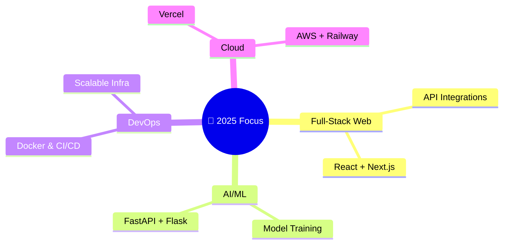

<h1 align="center">🚀 Adarsh Sikreewal</h1>

  <em>3rd Year B.Tech CSE @ KIIT University · Full-Stack Developer · AI/ML Explorer</em> 
  <strong>📍 Jharkhand, India</strong>

  

---

## 🧠 About Me

- 🎓 I'm a **CSE undergrad** passionate about problem-solving and product building.
- 💻 I enjoy working on **AI/ML**, full-stack development, and impactful projects.
- 🌱 Currently learning **system design**, **DevOps**, and **SaaS development**.
- 🔍 Interested in EdTech, smart agriculture, and automation tools.
- 🛠️ Actively building academic & real-world utilities using AI and modern web stacks.

---

## 🧰 Tech Stack

<table width="100%">
  <tr>
    <td align="center"><strong>Languages</strong> 
      
    </td>
    <td align="center"><strong>Frontend</strong> 
      
    </td>
    <td align="center"><strong>Backend</strong> 
      
    </td>
  </tr>
  <tr>
    <td align="center"><strong>Database</strong> 
      
    </td>
    <td align="center"><strong>DevOps & Tools</strong> 
      
    </td>
    <td align="center"><strong>Cloud</strong> 
      
    </td>
  </tr>
</table>

---

## 🧩 Featured Projects

| 💡 Project                        | 🚀 Description                                                                                 | 🔧 Tech Stack                    |
| --------------------------------- | --------------------------------------------------------------------------------------------- | -------------------------------- |
| 🌾 Fertilizer Optimizer           | Recommends fertilizer type, quantity & timing using soil, crop, and weather data             | Python, ML, Flask, OpenWeather  |
| 📸 Image Finder Web App           | Authenticated web app for browsing high-res images                                            | Next.js, Auth.js, PostgreSQL    |
| 📬 Notification Service API       | In-app + Email + SMS notifications using RabbitMQ, Twilio, and scalable APIs                 | Node.js, Express, MailSender    |
| 📊 Product Management Dashboard   | Full-stack CRUD dashboard with secure auth and inventory tracking                            | Next.js, Neon, Tailwind CSS     |

> ✨ More projects available on [my GitHub](https://github.com/adarsh-sikreewal)

---

## 📈 GitHub Stats

  
  
   
  

---

## 📚 2025 Learning Roadmap

---

## 🎯 Goals Progress

| 🎯 Goal                              | ⏳ Status       | 📊 Progress |
| ----------------------------------- | -------------- | ----------- |
| 🚀 Launch SaaS using OpenAI         | 🟡 In Progress | 40%         |
| 🧠 Build 3 AI academic tools        | ✅ 2/3 Done    | 67%         |
| 📝 Write technical blogs (10)       | 🔵 Started     | 3/10        |
| 🌐 Contribute to Open Source        | 🟡 Active      | 4 PRs       |

---

## 🏆 Achievements

  

---

## 🤝 Let's Connect!

  

